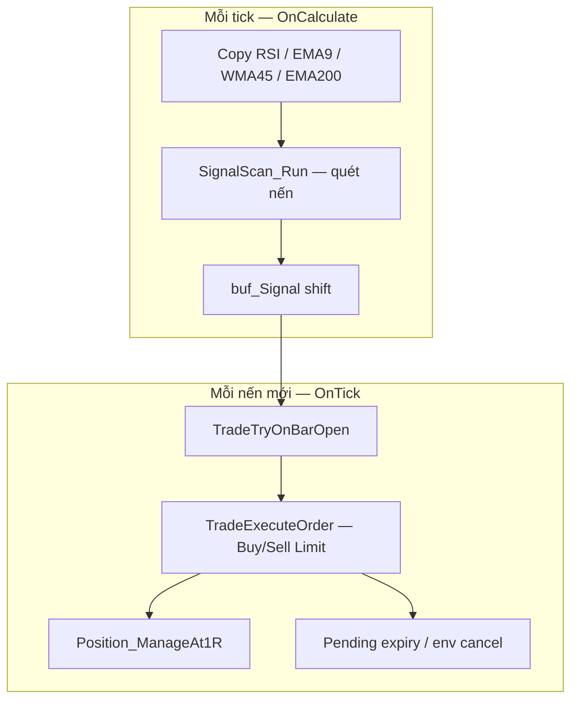
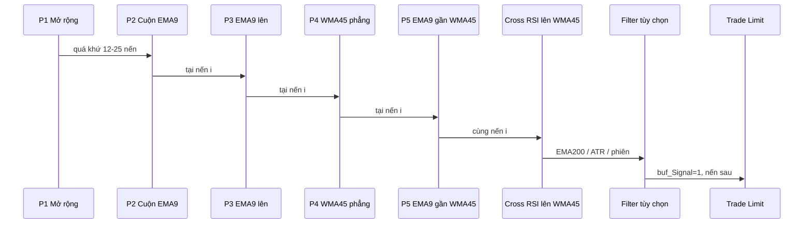

# RsiMomentumEA — Tài liệu logic

**Phiên bản EA:** 4.14  
**File chính:** `Experts/RsiMomentumEA.mq5`  
**Module:** `Include/RsiMom/PhaseEntry.mqh`, `SignalDebug.mqh`, `TradeJournal.mqh`

EA giao dịch theo **động lượng RSI** (RSI + EMA9 + WMA45 trên cùng thang RSI), kết hợp **chuỗi 5 phase** trước khi RSI cắt WMA45. Logic **độc lập** với indicator `RsiMomentumIndicator` (không đọc buffer indicator ngoài).

---

## 1. Tổng quan kiến trúc



| Thành phần | Vai trò |
|------------|---------|
| `buf_RSI`, `buf_EMA9`, `buf_WMA45` | Giá trị chỉ báo tại từng `shift` (series) |
| `buf_Signal` | `+1` BUY hợp lệ, `-1` SELL hợp lệ, `0` không tín hiệu |
| `buf_Trend` | `+1` / `-1` / `0` theo EMA200 (panel, không bắt buộc cho entry nếu tắt filter) |
| Mũi tên `RsiMomEA_CR_*` | Chỉ vẽ khi tín hiệu **đủ điều kiện** (pass toàn pipeline tín hiệu) |
| Mũi tên `RsiMomEA_DBG_*` | Mọi **cross RSI×WMA45** + lý do OK/SKIP (debug) |

---

## 2. Chỉ báo

Tất cả tính trên **khung thời gian chart** EA gắn (`_Symbol`, `_Period`).

| Handle | Công thức MT5 | Ghi chú |
|--------|---------------|---------|
| `h_RSI` | `iRSI(..., PRICE_CLOSE)` | RSI(14) mặc định |
| `h_EMA9` | `iMA(..., MODE_EMA, h_RSI)` | EMA9 **của RSI** |
| `h_WMA45` | `iMA(..., MODE_LWMA, h_RSI)` | WMA45 **của RSI** |
| `h_EMA200` | `iMA(..., PRICE_CLOSE)` | Trend trên **giá**, không phải RSI |
| `h_ATR_Regime` | ATR(14) | Bộ lọc ATR mở rộng (tùy chọn) |
| `h_ATR` | ATR(14) | Buffer SL sau swing |

**Quy ước index:** `shift = 1` là nến **vừa đóng**; `shift = 0` là nến đang hình thành. EA quét tín hiệu trên nến đã đóng (`i >= 1`).

---

## 3. Logic vào lệnh — tổng thể

Entry chỉ xảy ra khi **hai tầng** đều pass:

1. **Tầng tín hiệu** (`SignalScan_Run`) → ghi `buf_Signal[InpSignalBarShift]` (mặc định `1`).
2. **Tầng thực thi** (`TradeExecuteOrder` khi mở nến mới) → phiên/spread, Limit hợp lệ, SL/TP, volume.

### 3.1. Trigger bắt buộc (mọi lệnh)

Đánh giá tại nến `i` (thường `i = 1`).

**BUY — cross lên WMA45:**

```
RSI[i+1] <= WMA45[i+1]  AND  RSI[i] > WMA45[i]
```

**SELL — cross xuống WMA45:**

```
RSI[i+1] >= WMA45[i+1]  AND  RSI[i] < WMA45[i]
```

Không có cross → không xét tiếp.

### 3.2. Lõi entry: 5 phase hoặc EMA9 đơn giản

| `InpPhaseFilterEnabled` | Điều kiện lõi |
|-------------------------|----------------|
| `true` (mặc định) | `Phase_BuyPasses` / `Phase_SellPasses` — đủ P1→P5 (mục 4) |
| `false` | BUY: `EMA9[i] < WMA45[i]` — SELL: `EMA9[i] > WMA45[i]` |

### 3.3. Bộ lọc tín hiệu (tùy chọn, có thể tắt)

| Input | Mặc định (debug) | Điều kiện khi **bật** |
|-------|------------------|------------------------|
| `InpTrendFilterEnabled` | `false` | BUY: `InpTrendConfirmBars` nến liên tiếp có `Close > EMA200`. SELL: `Close < EMA200`. |
| `InpAtrExpFilterEnabled` | `true` | ATR(shift) / ATR(shift+cmp) ≥ `InpAtrExpMinRatio` **và** ATR tăng liên tiếp `InpAtrExpRiseBars` nến. |
| `InpAdxFilterEnabled` | `true` | ADX ≥ `InpAdxMinLevel`; BUY +DI>−DI, SELL ngược; tùy chọn ADX tăng / max / spread DI. |
| `InpSessionFilterEnabled` | `false` | Thời gian **nến tín hiệu** nằm London hoặc NY; không trong cửa sổ giao phiên; trừ `InpSessionAvoidLastMin` phút cuối phiên. |

**Tín hiệu hợp lệ (ghi `buf_Signal`):**

```
validBuy  = crossUp  AND coreBuy  AND trendUp  AND atrOk  AND sessionOk
validSell = crossDn  AND coreSell AND trendDn  AND atrOk  AND sessionOk
```

(`trendUp` / `atrOk` / `sessionOk` luôn `true` nếu filter tương ứng **tắt**.)

### 3.4. Tầng thực thi (đặt lệnh)

Khi **nến mới** mở (`OnTick`, `t0 != g_tradeBarAnchor`):

- Đọc `buf_Signal[1]`.
- Nếu `InpTradeEnabled` và `buf_Signal[1] == ±1` → `TradeExecuteOrder`.

**Thêm kiểm tra tại thời điểm đặt lệnh** (`Env_AllowsTradeAtBar`):

- Phiên + giao phiên (nếu `InpSessionFilterEnabled`).
- Spread ≤ `InpMaxSpreadPoints` (nếu `InpSpreadFilterEnabled`; trong Tester thường bỏ qua nếu `InpSpreadSkipInTester = true`).

**Không** đặt lệnh nếu:

- `InpOnePositionFlat` và đã có position/pending cùng magic.
- Limit @ 50% body không hợp lệ so với Bid/Ask + `STOPS_LEVEL`.
- Không tính được SL/TP swing hoặc volume = 0.

---

## 4. Entry 5 phase — chi tiết

Implement trong `Include/RsiMom/PhaseEntry.mqh`. Mô tả theo **BUY**; **SELL** đối xứng (mở rộng lên, EMA9 xuống, v.v.).

Quét trên các nến **đã đóng** trong lookback: từ `shift+1` trở về quá khứ (index series tăng = quá khứ).

### Phase 1 — Mở rộng (expansion)

**Ý nghĩa:** Trước đó ba đường RSI / EMA9 / WMA45 đã **xếp lớp** và giãn đủ mạnh (sóng động lượng).

**BUY:** Trong `InpPhaseExpandLookback` nến (mặc định 25), tìm nến `j` thỏa:

```
RSI[j] < EMA9[j] < WMA45[j]
spread[j] = WMA45[j] - RSI[j]  →  max(spread) >= InpPhaseMinExpandSpread  (mặc định 10 điểm RSI)
```

**SELL:** `RSI[j] > EMA9[j] > WMA45[j]`, `spread = RSI[j] - WMA45[j]`.

Fail tag: `P1-mở rộng`.

### Phase 2 — Cuộn quanh EMA9 (coil)

**Ý nghĩa:** RSI không chỉ **xuyên** EMA9 một lần mà **đan** qua lại (chuẩn bị trước cắt WMA45).

Trong `InpPhaseCoilLookback` nến (mặc định 12), đếm số lần RSI cắt EMA9 (lên hoặc xuống):

```
cross tại j nếu:
  (RSI[j+1] <= EMA9[j+1] && RSI[j] > EMA9[j])  OR
  (RSI[j+1] >= EMA9[j+1] && RSI[j] < EMA9[j])
```

Yêu cầu: `số_cross >= InpPhaseMinRsiEma9Cross` (mặc định **2**).

> **Lưu ý:** `InpPhaseCoilBand` được khai báo trong input nhưng **chưa dùng** trong `Phase_BuyPasses` (chỉ đếm cross). Hàm `Phase_CountCoilBars` có sẵn để mở rộng sau.

Fail tag: `P2-cuộn`.

### Phase 3 — EMA9 quay hướng (đã nới lỏng)

**BUY:** EMA9 **không được giảm quá mạnh** trong cửa sổ `InpPhaseEma9SlopeBars` (mặc định **2**):

```
EMA9[i] >= EMA9[i + bars] - InpPhaseEma9SlopeTol    (tol mặc định 1.5 pt RSI)
```

Cho phép EMA9 **phẳng hoặc hơi lệch** thay vì bắt buộc tăng rõ.

**SELL:** `EMA9[i] <= EMA9[i + bars] + tol`.

Fail tag: `P3-EMA9↑` / `P3-EMA9↓`.

### Phase 4 — WMA45 phẳng lại

**Ý nghĩa:** WMA45 trước đó dốc theo hướng sóng; tại nến tín hiệu đã **làm phẳng** (sắp cắt).

Với `b = InpPhaseWmaFlatBars` (mặc định 5):

```
recent = (WMA45[i] - WMA45[i+b]) / b
prior  = (WMA45[i+b] - WMA45[i+2b]) / b
```

**BUY:**

- `|recent| <= InpPhaseWmaFlatMaxSlope` (mặc định **0.55** — lỏng hơn 0.35 cũ).
- Quá khứ WMA45:
  - `InpPhaseWmaRelaxPrior = true` (mặc định): chỉ cần `prior < 0` (từng giảm, không cần dốc mạnh).
  - `false`: cần `prior <= -InpPhaseWmaWasSlopeMin` (mặc định **0.08**).

**SELL:** đối xứng (`prior > 0` khi relax).

Fail tag: `P4-WMA45 phẳng`.

### Phase 5 — EMA9 gần WMA45 tại cắt

**Ý nghĩa:** Cross xảy ra **gần** WMA45, không phải RSI đã bứt xa (tín hiệu yếu / muộn).

**BUY:**

```
EMA9[i] < WMA45[i]
(WMA45[i] - EMA9[i]) <= InpPhaseMaxEma9WmaGap   (mặc định **18** điểm RSI)
```

**SELL:** `EMA9[i] > WMA45[i]`, `(EMA9[i] - WMA45[i]) <= gap`.

Fail tag: `P5-EMA9 xa WMA45`.

### Thứ tự kiểm tra trong code

P1 → P2 → P3 → P4 → P5 (fail fast, `failTag` ghi phase đầu tiên lỗi).

**Cross WMA45 (trigger) không nằm trong P5** — luôn kiểm tra **trước** trong `SignalScan_Run`.

---

## 5. Sơ đồ chuỗi BUY (hình dung)



---

## 6. Thực thi lệnh

### 6.1. Loại lệnh và giá vào

- **Buy Limit / Sell Limit** tại **50% thân nến tín hiệu**:

```
entry = (Open[InpSignalBarShift] + Close[InpSignalBarShift]) / 2
```

- BUY Limit: giá **dưới** Ask (có khoảng cách `STOPS_LEVEL` / `FREEZE_LEVEL`).
- SELL Limit: giá **trên** Bid.

### 6.2. Stop loss

- Tìm **swing pivot** gần nhất trong `InpSwingMaxBars` (mặc định 30):
  - BUY: đáy pivot (low thấp hơn 2 nến kề).
  - SELL: đỉnh pivot.
- Nếu không có pivot: min/max low/high trong cửa sổ.
- SL = pivot ± **buffer**:
  - `spread × Point` nếu `InpSlAtrAddSpread`.
  - `+ ATR(1) × InpSlAtrMultiplier` nếu `InpSlAtrBufferEnabled`.

### 6.3. Take profit

```
risk = |entry - SL|
TP   = entry ± risk × InpRewardRiskRatio   (mặc định 1.1 R)
```

### 6.4. Khối lượng

```
riskMoney = Balance × (InpRiskPercent / 100)
volume    = riskMoney / lossPerLot(1 lot từ entry → SL)
```

Làm tròn theo `SYMBOL_VOLUME_STEP`, tối thiểu `SYMBOL_VOLUME_MIN`.

### 6.5. Pending

| Hành vi | Input |
|---------|--------|
| Hủy sau N nến không khớp | `InpLimitExpireBars` (40) |
| Hủy khi phiên/spread xấu | `Pending_EnvCancelIfBad` |
| Hủy pending cũ trước khi đặt mới | `Pending_CancelMine` trong `TradeExecuteOrder` |
| Một vị thế / một pending | `InpOnePositionFlat` |

---

## 7. Quản lý lệnh mở

**`InpManageAt1R` (mặc định bật):**

Khi lợi nhuận floating ≥ **1R** (R = khoảng cách entry → SL lúc mở lệnh):

1. Chốt `InpPartialCloseRatio` volume (mặc định 50%).
2. Dời SL về entry ± `InpBreakevenOffsetPts`.

Chỉ thực hiện một lần mỗi ticket (`g_pmAt1RDone`).

---

## 8. Debug trên chart

| Input | Mô tả |
|-------|--------|
| `InpDebugMarkSignals` | Vẽ `RsiMomEA_DBG_*` tại **mọi** cross RSI×WMA45 |
| `InpDebugMarkMaxBars` | Giới hạn N nến gần nhất |
| `InpDebugLogExperts` | 1 dòng Experts / nến tín hiệu (không lặp mỗi tick) |

**Màu / nhãn:**

| Hiển thị | Ý nghĩa |
|----------|---------|
| Xanh **OK** | Pass tín hiệu + pass đặt lệnh (tại nến signal) |
| Vàng **SIG** | Pass tín hiệu, không đặt (trade tắt / env) |
| Đỏ **SKIP** | Cross nhưng fail P1–P5 hoặc filter |

Tooltip: `RSI↑WMA45 | P1:OK | P2:FAIL(x=1) | … | EMA200:OFF | ATR:OFF | Phiên:OFF | Đặt lệnh:OK`.

Logic đánh giá: `Include/RsiMom/SignalDebug.mqh`.

---

## 9. Phiên & spread (khi bật lại)

**Phiên** (`InpSessionFilterEnabled = true`):

- London: `InpLondonStartHour`–`InpLondonEndHour` (mặc định 8–17).
- New York: `InpNYStartHour`–`InpNYEndHour` (13–22).
- Giờ: **server broker** nếu `InpEnvUseUtc = false`, ngược lại quy đổi UTC.
- Trừ `InpSessionAvoidLastMin` phút cuối mỗi cửa sổ.
- `InpTransitionBlockEnabled`: chặn thêm cửa sổ 7–8h và 21–22h (giao phiên).

Khi `InpSessionFilterEnabled = false`: **bỏ toàn bộ** lọc phiên và giao phiên.

**Spread:** `SYMBOL_SPREAD` (points) ≤ `InpMaxSpreadPoints`. Tester: thường dùng `InpSpreadSkipInTester = true`.

---

## 10. Journal CSV

`InpExportTradeJournal`:

- `FILE_COMMON/RsiMomEA/journal_SYMBOL_PERIOD.csv` — từng lệnh đóng.
- `summary_SYMBOL_PERIOD.csv` — tổng hợp theo tháng.

`InpJournalResetOnInit`: xóa CSV cũ mỗi lần chạy backtest mới trong Tester.

---

## 11. Cấu trúc file

```
Experts/
  RsiMomentumEA.mq5          # EA chính, inputs, scan, trade
  RsiMomentumEA_README.md    # Tài liệu này

Include/RsiMom/
  PhaseEntry.mqh             # P1–P5
  SignalDebug.mqh            # Đánh dấu + checklist tooltip
  TradeJournal.mqh           # Xuất CSV
```

---

## 12. Preset gợi ý

### Debug 5 phase (mặc định hiện tại)

```
InpPhaseFilterEnabled   = true
InpTrendFilterEnabled   = false
InpAtrExpFilterEnabled  = true
InpSessionFilterEnabled = false
InpDebugMarkSignals     = true
```

Chỉ còn: **cross RSI×WMA45 + P1–P5** (+ spread nếu bật và không skip tester).

### Live / backtest đầy đủ

```
InpTrendFilterEnabled   = true
InpTrendConfirmBars     = 1
InpAtrExpFilterEnabled  = true
InpSessionFilterEnabled = true
InpSpreadFilterEnabled  = true
```

---

## 13. Khác biệt với indicator

EA **không** đọc file indicator. Indicator `Indicators/RsiMomentumIndicator` có thể có thêm rule (EMA9 persist, slope RSI, OB/OS) chưa port sang EA — khi so sánh chart indicator vs EA cần kiểm tra từng input tương ứng.

---

## 14. Tham chiếu nhanh input entry

| Input | Mặc định | Phase / vai trò |
|-------|----------|-----------------|
| `InpPhaseExpandLookback` | 25 | P1 |
| `InpPhaseMinExpandSpread` | 10.0 | P1 — tối ưu edge (xem §15) |
| `InpPhaseCoilLookback` | 12 | P2 |
| `InpPhaseMinRsiEma9Cross` | 2 | P2 |
| `InpPhaseEma9SlopeBars` | 2 | P3 |
| `InpPhaseEma9SlopeTol` | 1.5 | P3 |
| `InpPhaseWmaFlatBars` | 4 | P4 |
| `InpPhaseWmaWasSlopeMin` | 0.08 | P4 (khi RelaxPrior=false) |
| `InpPhaseWmaFlatMaxSlope` | 0.55 | P4 |
| `InpPhaseWmaRelaxPrior` | true | P4 |
| `InpPhaseMaxEma9WmaGap` | 18.0 | P5 |
| `InpSignalBarShift` | 1 | Nến tín hiệu & Limit |

---

## 15. Tối ưu P1 — độ mở rộng (`InpPhaseMinExpandSpread`)

**Mục tiêu:** Lọc setup yếu — chỉ vào khi sóng trước đó đã giãn RSI↔WMA45 đủ lớn.

**Strategy Tester (MT5):**

1. Tab **Inputs** → chọn `InpPhaseMinExpandSpread` → bật **Optimization**.
2. Gợi ý: **Start** `6`, **Stop** `18`, **Step** `1` (XAU M5/M15; FX có thể thử 5–14).
3. Tiêu chí: **Profit Factor** hoặc **Custom max** (PF × sqrt(trades) nếu cần đủ mẫu).
4. So sánh **số lệnh** vs PF — ngưỡng quá cao → ít lệnh, overfit.

**Debug trên chart:** dấu SKIP hover hiển thị `P1:FAIL(sp=7.2<10.0)` = max spread tìm được trong lookback chưa đạt ngưỡng; `P1:OK(sp=12.4>=10.0)` = đạt.

**Panel:** dòng `5 phase` hiển thị `P1>=10.0 LB25`.

---

---

## 16. Tối ưu ATR mở rộng

**Mục tiêu:** Bỏ entry khi biến động “ngủ” (ATR không tăng) — thường giảm chop, có thể tăng PF.

| Input | Mặc định | Gợi ý sweep |
|-------|----------|-------------|
| `InpAtrExpMinRatio` | 1.005 | 1.003–1.015 (step 0.001) |
| `InpAtrExpRiseBars` | 2 | 1 (lỏng) hoặc 3 (chặt) |
| `InpAtrExpCompareBars` | 3 | 2–5 |

Debug: SKIP `ATR co` hoặc tooltip `ATR:FAIL`. Nếu **0 lệnh** sau bật filter → hạ `MinRatio` hoặc `RiseBars=1`.

---

---

## 17. Lọc ADX (trend mạnh)

**Mục tiêu:** Chỉ pullback khi thị trường **có trend** (ADX đủ cao) và **đúng hướng** (+DI/−DI).

| Input | Mặc định | Ý nghĩa |
|-------|----------|---------|
| `InpAdxMinLevel` | 22 | ADX &lt; 20 thường sideway; 22–35 vùng trend ổn |
| `InpAdxRequireDiDirection` | true | BUY: +DI &gt; −DI; SELL: −DI &gt; +DI |
| `InpAdxMinDiSpread` | 0 | Chênh +DI−(−DI) tối thiểu (thử 5–10) |
| `InpAdxRiseBars` | 0 | ADX tăng vs N nến (1–2 = trend đang mạnh lên) |
| `InpAdxMaxLevel` | 0 | 0=tắt; ví dụ 45 tránh vào khi trend quá già |

Debug: `ADX:OK(28.5 +DI=32.0 -DI=18.0)` hoặc SKIP `ADX yếu`.

---

*Tài liệu đồng bộ với mã nguồn v4.29.*
