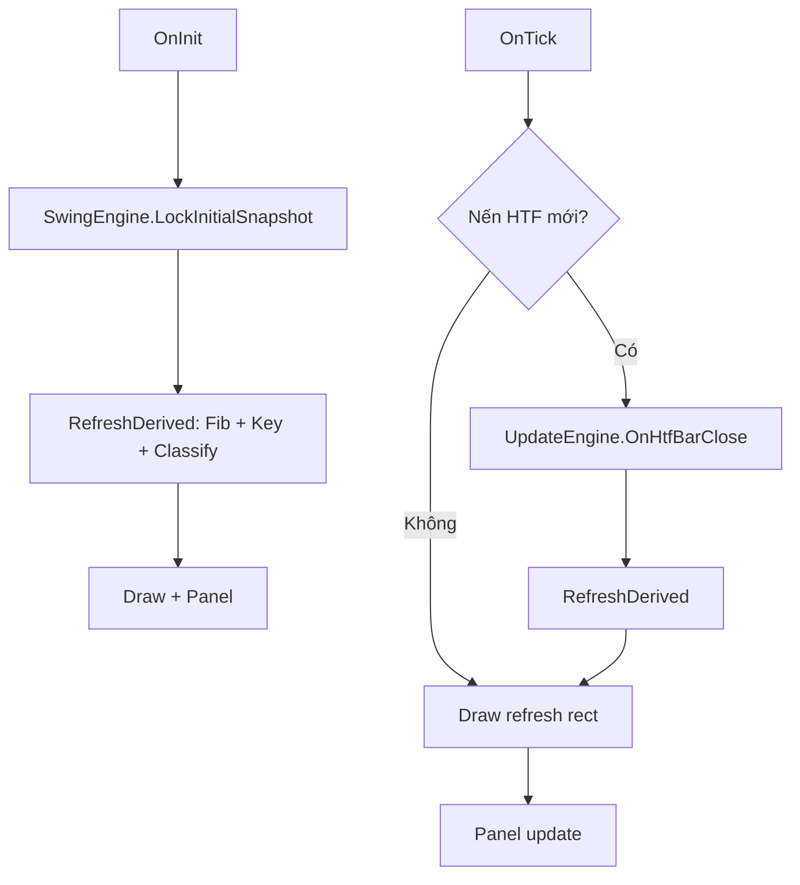

# HyperICT

Expert Advisor **chỉ đọc cấu trúc thị trường HTF** (Higher Timeframe): swing H0–L1, Key Level, vùng cung/cầu (Order Block), trạng thái Pullback / CHoCH / Continue. **Không đặt lệnh.**

Phiên bản hiện tại: **0.11**

---

## Mục lục

<!-- Link dùng id ASCII (Cursor/VS Code không ổn định với anchor tiếng Việt có dấu) -->

1. [Cấu trúc thư mục](#folder-structure)
2. [Logic nghiệp vụ](#business-logic)
3. [Mô tả từng file](#file-reference)
4. [Luồng chạy (pipeline)](#pipeline)
5. [Cài đặt & sử dụng](#installation)
6. [Tham số input](#inputs)
7. [Trạng thái hiển thị](#display-states)
8. [API mở rộng](#api)
9. [Giới hạn & hướng phát triển](#roadmap)
10. [Map spec → module](#spec-map)

---

<a id="folder-structure"></a>

## Cấu trúc thư mục

```
MQL5/
├── Experts/
│   └── HyperICT.mq5              ← EA chính (OnInit / OnTick)
│
└── Include/
    └── HyperICT/
        ├── README.md               ← tài liệu này
        ├── Types.mqh               ← enum, struct
        ├── Config.mqh              ← input
        ├── FibValidator.mqh        ← Fib 0.382 (chỉ tiên quyết)
        ├── SwingEngine.mqh         ← pivot, snapshot, roll swing
        ├── KeyLevels.mqh           ← Key LV1/L2, OB, body break
        ├── Classifier.mqh          ← 7+ trạng thái trend
        ├── UpdateEngine.mqh        ← §1.4 CHoCH / Continue
        ├── StateMachine.mqh        ← pipeline điều phối
        ├── Draw.mqh                ← vẽ chart
        └── Panel.mqh               ← panel góc chart
```

**Include trong code:** `#include <HyperICT/TênFile.mqh>`

---

<a id="business-logic"></a>

## Logic nghiệp vụ

### Điều kiện tiên quyết (chỉ lúc xác định trend)

| Xu hướng | Cấu trúc | Fib |
|----------|---------|-----|
| **Bull** | HH-HL (`H0>H1` và `L0>L1`) | Sóng hồi **H1→L0** ≥ **38.2%** sóng **L1→H1** |
| **Bear** | LH-LL | Cùng công thức Fib |

- **Fib fail** → state `BULL/BEAR (Fib pending)` — *không* coi là Neutral.
- **Neutral** chỉ khi không đủ 4 swing hoặc cấu trúc không HH-HL / LH-LL.

### Swing H0, H1, L0, L1 (ghép theo leg — không lấy 2 đỉnh + 2 đáy tách rời)

Trên HTF, pivot được gán sao cho **Key LV1 tạo ra Key LV2** (đúng thứ tự thời gian):

| Bias | Key LV1 | Key LV2 | Cách gán |
|------|---------|---------|----------|
| **Bear** | **H0** = Key LV1 (đỉnh trước L0) | **L0** = Key LV2 | Thời gian: **H1 → L1 → H0 → L0** |
| **Bull** | **L0** = Key LV1 (đáy trước H0) | **H0** = Key LV2 | Thời gian: **L1 → H1 → L0 → H0** |

Gán pivot: từ L0/H0 gần nhất, lùi từng bước tới pivot cũ **kề** (không nhảy tới đỉnh/đáy xa hơn).

- **Đỉnh/đáy hình thành sau Key LV2** (ví dụ đỉnh nhỏ sau L0 trong bear) **không** gán là H0 — thuộc `newH0` / `UpdateEngine` §1.4.
- **Khóa snapshot** khi bot chạy — chỉ đổi khi phá Key (§1.4).

### Key Level (§1.2)

| Bias | Key LV1 | Key LV2 | Vùng cung | Vùng cầu |
|------|---------|---------|-----------|----------|
| Bull | **L0** | **H0** (= đỉnh cao nhất L0→H0) | L0 → high nến đỏ OB | H0 → low nến xanh OB |
| Bear | **H0** | **L0** | (đối xứng) | (đối xứng) |

- **Phá Key** = thân nến (`max/min` open–close) trên bar HTF **đã đóng** (shift 1).
- Phá **Key LV1** → tín hiệu **CHoCH**.
- Phá **Key LV2** → tín hiệu **Trend Continue**.

### Trạng thái trend (§1.1)

| State | Điều kiện chính |
|-------|-----------------|
| **Bull Pullback** | Fib OK + giá giữa L0–H0 |
| **Bull CHoCH** | Body phá dưới L0, hoặc đang xử lý §1.4 CHoCH |
| **Bull Continue** | Body phá trên H0 / đang tạo newH0 |
| **Bear Pullback / CHoCH / Continue** | Đối xứng |
| **Neutral** | Không phân loại được cấu trúc |

### Cập nhật sau phá Key (§1.4) — không quét lại full history

**Xác nhận đỉnh/đáy mới:** dùng `InpSwingRange` (pivot đủ N nến mỗi bên). **Không** dùng Fib trong giai đoạn này.

#### Bull Continue (phá H0)

1. **P1:** Body phá H0 → track `newH0` (nến xanh, high cao hơn), `newL0` (đáy impulse).
2. **P2:** Hồi đủ → `IsConfirmedSwingHigh(newH0)` → roll: `H0→H1`, `L0→L1`, `newH0→H0`, `newL0→L0`.

#### Bull CHoCH (phá L0)

1. **P1:** Track `newL0` (low thấp hơn).
2. **P2:** `IsConfirmedSwingLow(newL0)` **hoặc** hồi lên đủ `InpSwingRange` (swing high sau đáy) → khóa `newL0`, vào phase 3 (không kéo `newL0` nữa).
3. **P3 case 1:** Phá lên H0 → `newH0` confirm → roll bull (`L1` giữ).
4. **P3 case 2:** Body phá xuống `newL0` đã khóa → track `newH0` (confirm) → track `newL02` (confirm tuần tự) → roll bear.

Bear Continue / CHoCH: **đối xứng** với bull.

---

<a id="file-reference"></a>

## Mô tả từng file

### `Experts/HyperICT.mq5`

- Entry point: khởi tạo `HtfContext`, gọi `StateMachine`, `Draw`, `Panel`.
- `OnTick`: logic HTF chỉ khi **nến HTF mới**; vẽ rectangle cập nhật mỗi tick.
- Export: `HyperICT_GetState()` cho EA khác.

### `Types.mqh`

- `ENUM_STRUCT_BIAS`, `ENUM_HTF_STATE`, `ENUM_UPDATE_EVENT`, `ENUM_UPDATE_PHASE`.
- `SwingPoint`, `SwingSet`, `OrderBlockZone`, `KeyLevelPair`, `UpdateContext`, `HtfContext`.
- Không chứa logic tính toán.

### `Config.mqh`

- Toàn bộ `input`: HTF, swing range, lookback, Fib ratio, màu vẽ, debug.
- Prefix object chart: `HICT_`.

### `FibValidator.mqh`

- `IsPullbackValid()` — H1→L0 vs L1→H1 × `InpFibMinRatio`.
- **Chỉ** dùng cho tiên quyết trend (và tính lại sau roll swing).

### `SwingEngine.mqh`

- `IsSwingHigh` / `IsSwingLow`, `CollectSwings`, `PickLastTwo`.
- `LockInitialSnapshot`, `ClassifyStructure` (HH-HL / LH-LL).
- `IsConfirmedSwingHigh/Low` — xác nhận pivot sau phá Key.
- `RollBullContinue`, `RollBullChochCase1/2`, `RollBearContinue`, …

### `KeyLevels.mqh`

- Body break above/below.
- `FindSupplyOB` / `FindDemandOB`.
- `BuildKeyLevels`, `PriceBetween` (Pullback zone).

### `Classifier.mqh`

- `Evaluate()` → một trong các `ENUM_HTF_STATE`.
- Ưu tiên: đang `update.phase` → CHoCH/Continue; sau đó Fib pending; sau đó Pullback/break.

### `UpdateEngine.mqh`

- `DetectBreakEvents` — phá Key LV1/L2.
- `ProcessBullContinueBuild`, `ProcessBullChochBuild`, `ProcessBullChochResolve`, …
- `OnHtfBarClose` — gọi mỗi nến HTF mới.

### `StateMachine.mqh`

- `Init()` → lock snapshot + `RefreshDerived`.
- `OnChartEvent()` → `IsNewHtfBar` → `UpdateEngine` → Fib + Key + Classifier.

### `Draw.mqh`

- Label H0–L1, newH0/newL0/newL02.
- Rectangle Key LV1/L2 (kéo tới thời điểm hiện tại).

### `Panel.mqh`

- Label góc trái: structure, Fib, state, Key prices, phase update.

---

<a id="pipeline"></a>

## Luồng chạy (pipeline)



---

<a id="installation"></a>

## Cài đặt & sử dụng

1. Copy `Experts/HyperICT.mq5` và thư mục `Include/HyperICT/` vào terminal MT5.
2. MetaEditor → mở `HyperICT.mq5` → **F7** compile.
3. Kéo EA lên chart (symbol cần đủ lịch sử HTF).
4. Khuyến nghị: mở chart **cùng symbol**; HTF logic đọc `InpHtf` (mặc định H1) dù chart có thể M15/M5.
5. Bật `InpDebug = true` để xem log `[HyperICT]` và `[HyperICT/Update]` trong tab Experts.

### Gợi ý tinh chỉnh

| Triệu chứng | Thử |
|-------------|-----|
| Init fail / không đủ swing | Giảm `InpSwingRange` hoặc tăng `InpSwingLookback` |
| Pivot confirm chậm | Giảm `InpSwingRange` |
| Pivot nhiễu | Tăng `InpSwingRange` |
| Fib mãi pending | Kiểm tra sóng H1→L0 trên chart H1 |

---

<a id="inputs"></a>

## Tham số input

| Input | Mặc định | Ý nghĩa |
|-------|----------|---------|
| `InpHtf` | H1 | Timeframe cấu trúc |
| `InpSwingRange` | 3 | Nến mỗi bên pivot; confirm đỉnh/đáy §1.4 |
| `InpSwingLookback` | 400 | Số nến quét lúc lock ban đầu |
| `InpFibMinRatio` | 0.382 | Tiên quyết pullback (chỉ lúc lock trend) |
| `InpDrawSwings` | true | Label H0–L1 |
| `InpDrawZones` | true | Rectangle Key LV |
| `InpDrawPanel` | true | Panel trạng thái |
| `InpDebug` | false | Log chi tiết |

---

<a id="display-states"></a>

## Trạng thái hiển thị

| Panel text | Ý nghĩa |
|------------|---------|
| `BULL PULLBACK` | Bull hợp lệ, giá trong L0–H0 |
| `BULL (Fib pending)` | HH-HL nhưng hồi chưa đủ 38.2% |
| `BULL CHoCH` | Phá L0 hoặc đang update CHoCH |
| `BULL CONTINUE` | Phá H0 / đang tạo đỉnh mới |
| `BEAR …` | Đối xứng |
| `NEUTRAL` | Cấu trúc không rõ |

Khi đang update: dòng `Update: evt=… phase=… | swingR=…`.

---

<a id="api"></a>

## API mở rộng

```cpp
// Trong HyperICT.mq5 — có thể #include Types từ EA khác nếu cần enum
ENUM_HTF_STATE HyperICT_GetState();
```

Trả về `ctx.state` hiện tại. EA khác có thể đọc sau khi HyperICT chạy trên cùng chart (cần thiết kế thêm export nếu muốn đọc swing/Key từ bên ngoài).

---

<a id="roadmap"></a>

## Giới hạn & hướng phát triển

### Đã có

- HTF structure, Key LV, OB đơn giản, 7+ states, snapshot lock, §1.4 incremental update với swing confirm.

### Chưa có

- Đặt lệnh, quản lý risk, session filter.
- LTF entry (MSS, FVG, …).
- OB mitigation filter chuẩn ICT.
- Vẽ trên chart HTF tách biệt (hiện dùng `ChartID()` đang mở).
- Alert / push notification.

### Hướng phát triển gợi ý

1. Test & harden `UpdateEngine` trên lịch sử (Strategy Tester visual).
2. Module `LTF` tách riêng, đọc `HyperICT_GetState()`.
3. Cải thiện `FindSupplyOB` / `FindDemandOB`.
4. Export struct `HtfContext` qua global hoặc file cho indicator.

---

<a id="spec-map"></a>

## Map spec → module (tóm tắt)

| Spec | Module |
|------|--------|
| Tiên quyết Fib + HH-HL | `FibValidator`, `SwingEngine` |
| §1.1 States | `Classifier`, `Panel` |
| §1.2 Key + OB | `KeyLevels`, `Draw` |
| §1.3 Vẽ | `Draw` |
| §1.4 CHoCH/Continue | `UpdateEngine`, `SwingEngine` |
| Pipeline | `StateMachine` |
| Input | `Config` |
| Data model | `Types` |

---

*Tài liệu đồng bộ với HyperICT v0.11. Khi đổi logic, cập nhật comment đầu từng file `.mqh` và README này.*
